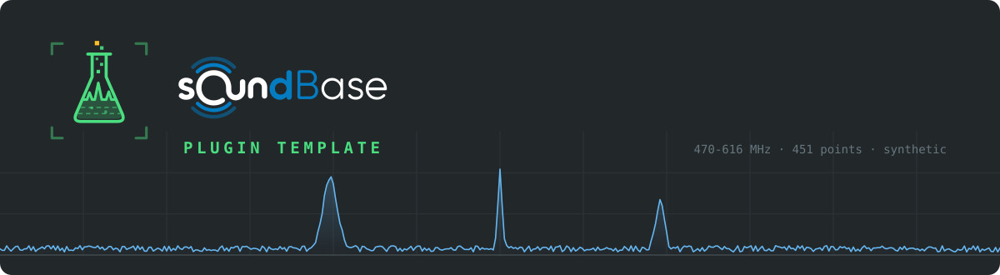

# SoundBase Plugin Template

A complete, working SoundBase plugin. Press **Use this template**, run it, and
you have a device in SoundBase's live-scan picker — it serves a synthetic
spectrum (a noise floor, two carriers, an intermittent transient) so the whole
path works before you own any hardware.

Then you replace one file.

```sh
npm install
npm run doctor      # is everything wired up?
npm start
# SB_PLUGIN_READY {"port":54321}
# [info] template 0.1.0 listening on 127.0.0.1:54321
```

```sh
npm test            # the contract, exercised against your adapter
npm run smoke       # boots main.js as a child process, exactly as the host does
```

**Never used SoundBase?** Start with
[docs/soundbase.md](docs/soundbase.md) — what the app is, what the people using
it are doing, and where your device lands. It is written for someone who will
never see the SoundBase code.

## What a plugin is

A **network service** that provides devices to SoundBase over a versioned HTTP
contract. SoundBase spawns it as a child process and supervises it —
handshake, health, crash-restart, teardown. You write device logic. You never
write UI, IPC, or HTTP.

```
soundbase-plugin.json   your identity, products and config fields
main.js                 shell bootstrap — copy it verbatim, don't edit it
adapter.js              your device logic. This is the file you replace.
driver/                 optional: anything protocol-specific adapter.js uses
```

`@soundbase/plugin-shell` implements the entire contract: the HTTP server on
`127.0.0.1:0`, the `SB_PLUGIN_READY` stdout handshake, bearer-token auth, SSE
lifecycle events, sweep-id bookkeeping, `GET /trace` long-polling, and
trace-mode accumulation at full sweep rate. Your adapter never sees a request.

## Installing the SDK

```sh
npm install
```

That is the whole setup. The two SDK packages are on public npm — nothing else
to fetch, and no SoundBase checkout required.

## Making it yours

**1. Take an id.**

```sh
npm run rename my-plugin-id -- --name "My Analyzer"
```

The id appears in four places that must agree — the manifest, every product's
`deviceTypeId`, `adapter.js`, and the package name. `rename` changes all four.
Do it before you publish anything: the id is stored in users' saved projects.

**2. Describe your hardware** in `soundbase-plugin.json` — one `products` entry
per model, plus the config fields SoundBase should render.
([reference](docs/manifest-reference.md))

**3. Replace `adapter.js`.** It exports two things:

```js
// called while SoundBase is enumerating; return currently reachable devices
export async function discoverDevices(pluginConfig) {
  return [{ id: 'usb:/dev/tty…', name: 'My Analyzer',
            product: 'plugin:my-id/model',
            transport: { kind: 'usb', path: '/dev/tty…' } }];
}

// one instance per device; device = { id, product, config }
export function createSpectrumAnalyzerAdapter(device, pluginConfig) {
  return {
    async open() {              // connect + identify
      return {
        capabilities: { minFrequencyHz, maxFrequencyHz, rbwHz: [...] },
        identity: { model, firmware },
      };
    },
    async applyConfig(cfg) {    // cfg = { startHz, stopHz, pointCount?, rbwHz?, controls? }
      return effective;         // echo what the hardware actually accepted
    },
    async startSweep(onTrace) { /* call onTrace(ampsDbm: number[]) per sweep */ },
    async stopSweep() {},
    async close() {},
  };
}
```

Full reference: [docs/adapter-reference.md](docs/adapter-reference.md).

**4. Keep the tests passing.** `__tests__/` drives your adapter through the
real shell over real HTTP. They are written against the *contract*, not against
the synthetic source, so they keep meaning once your adapter talks to hardware.

## A worked example with a real transport

[`examples/network-analyzer/`](examples/network-analyzer/README.md) is a second
complete plugin — a networked instrument over TCP — showing everything the
synthetic one skips: discovery by probing, addressing from device config, a
driver with its own fake, device controls, clamping, and a socket that dies
mid-sweep. Its tests run with nothing plugged in.

## Rules that will bite you if you break them

- **Device ids are yours and must be stable across restarts.** `usb:<path>`,
  `net:<host>` are the conventions the first-party plugins use. They appear in
  URLs, and a project stores them.
- **Device addressing arrives explicitly** on `POST /devices`. Never read a
  device address from your own machine-local state — the same project opened on
  another machine must work.
- **Clamp, don't reject.** When a requested RBW or reference level is out of
  range, snap it and echo what you settled on. The form keeps showing the
  user's saved value either way; a rejection just looks broken.
- **Echo the effective config.** `applyConfig`'s return value is what
  `GET /devices/{id}/configuration` reports, so the host can always read back
  what is actually in force.
- **`main.js` stays byte-identical.** If you find yourself editing it, the
  thing you want almost certainly belongs in `adapter.js`.

`npm run doctor` checks the ones a machine can check.

## Device controls — knobs SoundBase has never heard of

Return `controls` from `open()` and SoundBase renders them beside RBW and point
count, then hands the values back in `applyConfig`'s `cfg.controls`, keyed by
the same ids:

```js
controls: [
  { id: 'refLevelDbm', type: 'number', label: 'Reference level',
    unit: 'dBm', default: -20, min: -56, max: 20 },
  { id: 'detector', type: 'dropdown', label: 'Detector', default: 'peak',
    choices: [{ id: 'peak', label: 'Peak' }, { id: 'average', label: 'Average' }] },
]
```

Nothing between the form and your adapter interprets them — SoundBase never
learns what a detector is. That means **adding a knob to a shipped plugin needs
no SoundBase release.** Build them in `open()` so ranges can come from the
hardware you just identified.

## Native code, and the gotcha that will cost you a week

If your device needs a native library or a language runtime, read
[docs/native-runtimes.md](docs/native-runtimes.md) before you design anything.
The short version, learned the hard way on a USRP:

**Put wedge-prone native work in a child process you can kill.** A blocking C
library that owns a USB device can hang mid-call when someone trips over the
cable. If that call is in your plugin's process, your plugin is gone and
SoundBase restarts it. If it is in a child, you `SIGKILL` it, report a clean
device error, and stay healthy. The process boundary between SoundBase and you
protects *SoundBase*; you need your own boundary to protect *yourself*.

## Documentation

| | |
|---|---|
| [soundbase.md](docs/soundbase.md) | The app, the domain, and where your device lands. **Start here.** |
| [architecture.md](docs/architecture.md) | Process model, lifecycle, supervision, versioning |
| [getting-started.md](docs/getting-started.md) | Clone to first change, end to end |
| [adapter-reference.md](docs/adapter-reference.md) | Every adapter method in detail |
| [manifest-reference.md](docs/manifest-reference.md) | Every manifest field |
| [http-contract.md](docs/http-contract.md) | The wire, for debugging with `curl` |
| [testing.md](docs/testing.md) | The three checks, and faking hardware |
| [running-in-soundbase.md](docs/running-in-soundbase.md) | Install paths, feature flag, logs |
| [native-runtimes.md](docs/native-runtimes.md) | Native libraries and bundled runtimes |
| [publishing.md](docs/publishing.md) | Releases, the Lab, licensing |
| [troubleshooting.md](docs/troubleshooting.md) | Symptom → cause |
| [glossary.md](docs/glossary.md) | RF and SoundBase vocabulary |

## Scripts

| | |
|---|---|
| `npm start` | run the plugin |
| `npm test` | contract tests through the real shell |
| `npm run doctor` | is this plugin well-formed? with fixes for anything that isn't |
| `npm run smoke` | boot as a child process, handshake, sweep — what the host does |
| `npm run manifest` | validate `soundbase-plugin.json` against the contract schema |
| `npm run rename <id>` | take an id, in all four places it appears |
| `npm run pack:release` | build the zip users install, and boot-check it |
| `npm run release <x.y.z>` | tag, pack, and publish a GitHub Release |

## The specification

The normative documents install with your dependencies:

```
node_modules/@soundbase/plugin-contract/spec/
  soundbase-plugin.schema.json     validate your manifest against this
  core.openapi.yaml                the core plugin API
  spectrum-analyzer.openapi.yaml   the SpectrumAnalyzer module
```

They are not a copy that might have gone stale — they ship inside the contract
package, so they always describe the shell version your lockfile pins.

Unknown modules and unknown properties are tolerated everywhere, deliberately:
shipping a plugin must never require a SoundBase release.

## Versioning

Two version numbers that mean different things:

- **`version`** in `soundbase-plugin.json` and `package.json` is *yours*. Semver
  your plugin however you like.
- **`template`** records what you started from and should be left alone:

  ```json
  "template": { "name": "soundbase-plugin-template", "version": "1.0.0" }
  ```

  It is correct forever *because* it goes stale. When a template release notes
  a fix to the example error handling, this is what tells you whether it
  applies to you. Do not bump it to match a template you have not merged.

**`contract` is the only thing that governs compatibility.** Two plugins built
from different template versions can speak exactly the same contract, and an
old lineage does not make an incompatible plugin compatible.

## Working with Claude

[`CLAUDE.md`](CLAUDE.md) gives Claude Code and other coding agents the contract
invariants, the file map, and worked prompts for the common tasks —
implementing discovery, adding a control, wrapping a native driver. It is worth
reading yourself.

## Licence

This template and `@soundbase/plugin-shell` are licensed under the **Business
Source License 1.1** — source available, not open source. See `LICENSE` for the
exact terms, and read the **Additional Use Grant**: it permits developing,
distributing and operating plugins for SoundBase, including commercially, and
does not permit using this code with anything that is not SoundBase.

Each version converts automatically to the Change License named in `LICENSE` on
its Change Date.

Your own plugin code is yours; licence it however you like. The Additional Use
Grant governs the parts you received under this licence.

## Support

Issues on this repository are for the template itself. For the plugin contract,
device behaviour, or getting a plugin listed, see the SoundBase Lab.
