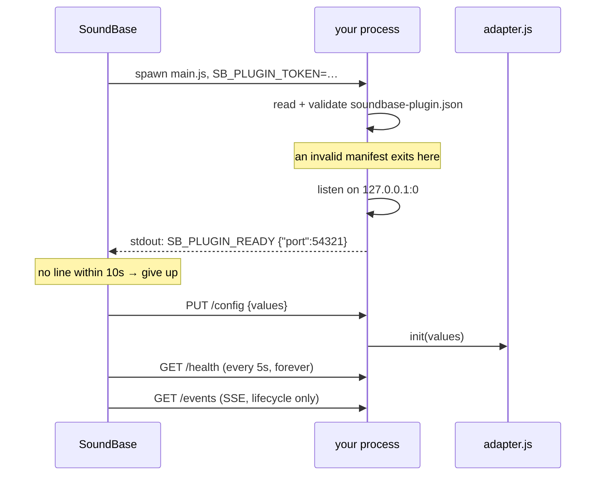
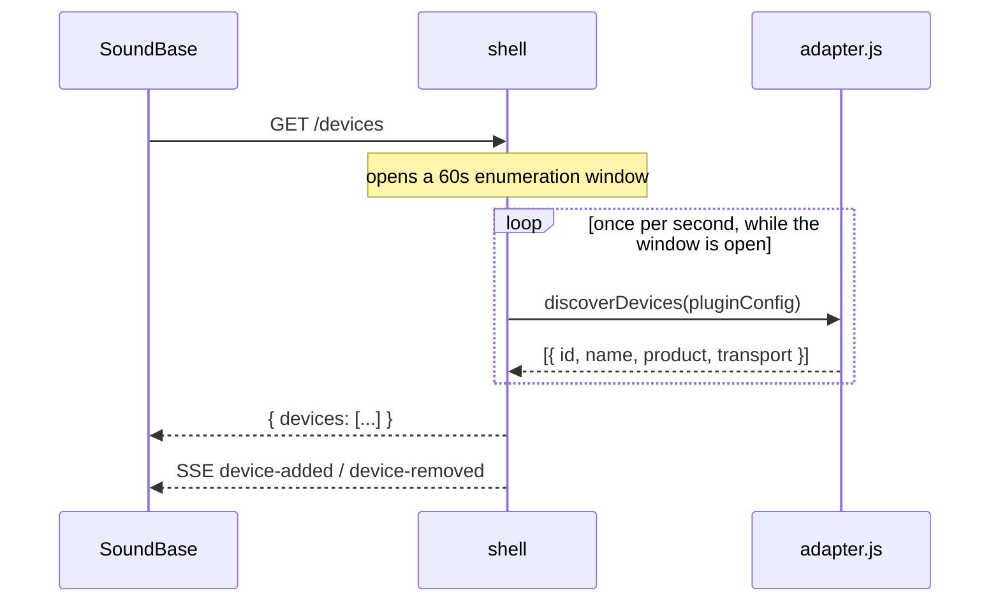
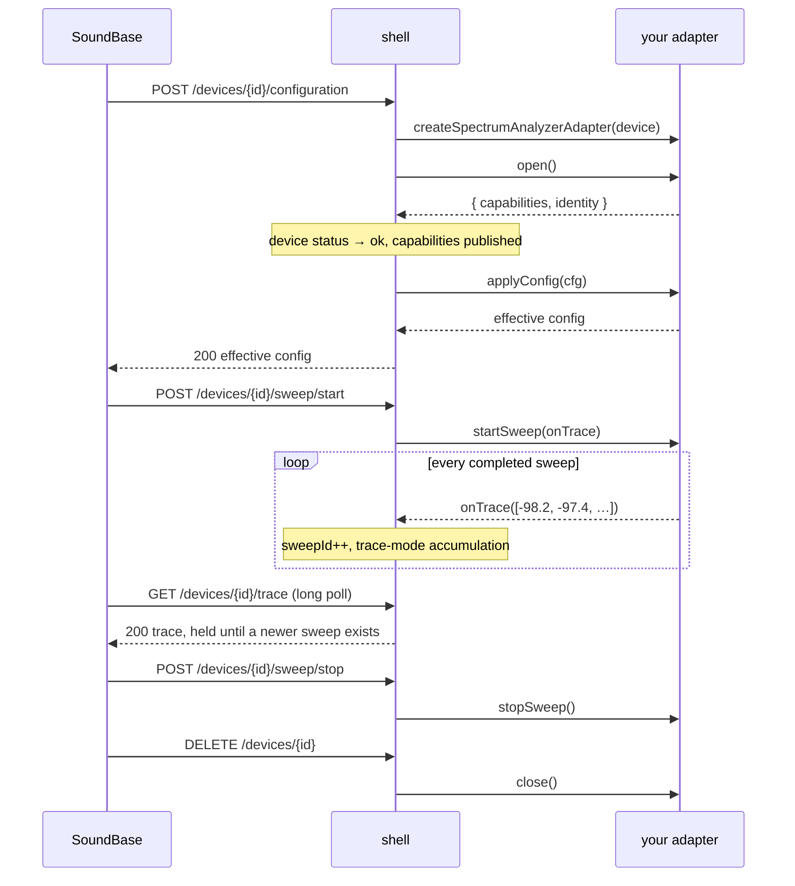

# How a plugin is wired to SoundBase

## The one-sentence version

A plugin is an ordinary Node process that SoundBase starts, supervises and
talks to over loopback HTTP — you implement a device adapter, and a library
called the *shell* implements everything else.

## The process model

```
┌─────────────────────────────────────────┐
│ SoundBase Desktop (Electron)            │
│                                         │
│   plot, device picker, plugin manager   │
│                     │                   │
│              plugin host                │
└─────────────────────┼───────────────────┘
                      │  spawn + supervise
                      │  HTTP on 127.0.0.1:<ephemeral>
                      │  bearer token, per spawn
┌─────────────────────▼───────────────────┐
│ your plugin process                     │
│                                         │
│   main.js  ──►  @soundbase/plugin-shell │
│                       │                 │
│                  adapter.js   ◄── yours │
│                       │                 │
│                   driver/     ◄── yours │
└─────────────────────┬───────────────────┘
                      │ USB / TCP / whatever
                 ┌────▼────┐
                 │ hardware │
                 └──────────┘
```

Three properties of that picture matter:

**It is a separate process.** If your plugin crashes, leaks, or wedges in a
blocking native call, SoundBase does not. It notices, reports your plugin as
failed, and restarts it. This is *fault isolation, not a security sandbox* —
your plugin runs with the user's privileges, and installing one means trusting
its author, exactly like a VST or a Companion module.

**It is loopback HTTP, not IPC.** Nothing about the transport is special, which
means you can `curl` your plugin while you develop it, and a plugin written in
another language would be a legitimate thing to build (the Node shell is the
paved road, not the only possible road).

**It is versioned.** Your manifest declares which contract version you
implement. SoundBase must silently tolerate modules and properties it does not
recognise — that rule is what makes it possible to ship a plugin without
shipping a SoundBase release.

## Who does what

| | |
|---|---|
| **SoundBase** | spawns and supervises the process, renders your devices and your config fields, stores device configuration in the project, draws traces, decides what to ask for |
| **`@soundbase/plugin-shell`** | the HTTP server on `127.0.0.1:0`, the stdout handshake, bearer-token auth, the SSE event stream, the device registry, the discovery window, sweep ids, `GET /trace` long-polling, trace-mode accumulation, coalescing overlapping reconfigures |
| **your `adapter.js`** | find devices, open one, apply a configuration, produce sweeps, close |
| **your `driver/`** | the wire protocol, if there is one |

Your adapter never sees an HTTP request, a socket, a token, or a sweep id.
If you find yourself writing any of those, the design has gone wrong.

## Startup, step by step



The handshake line is the whole of the startup contract, and it is where
silent failures live: **a plugin that never prints it is simply invisible**,
with nothing in any log explaining why. `npm run smoke` exists to prove that
one line arrives.

## Finding devices

Discovery is polled, but only while someone is interested.



Outside a window the shell calls `discoverDevices` **not at all**. An idle
plugin does no discovery I/O, so it never holds a serial port the user wants
for something else. The window is also held open for as long as any device has
an open transport.

Devices can also arrive the other way: `POST /devices` adds a device the user
configured by hand, carrying its addressing in the request. Those are opened
eagerly, so a wrong address reports as a failed device instead of looking fine
until someone starts a sweep.

## One device, from open to close



Two details that surprise people:

**A discovered device is not opened until something asks it to do work.** It
appears in `GET /devices` with `capabilities: null` and status `disconnected`;
`open()` runs on the first operation against it. A plugin that opened every
device it could see would fight the user's other software for every port on the
machine.

**Traces are pulled, not pushed.** SoundBase long-polls `GET /trace`: the shell
holds the response open until a sweep newer than the last one served completes,
capping the hold at 5 seconds. The poll rate therefore matches your hardware
with no interval to tune anywhere. Measurement data never travels on the SSE
stream — that carries lifecycle only.

## Supervision, and what happens when things break

The host applies the same policy to every plugin:

| | |
|---|---|
| Handshake timeout | 10 s from spawn to `SB_PLUGIN_READY` |
| Health polling | `GET /health` every 5 s; 3 consecutive failures counts as a crash |
| Restart backoff | 1 s, 2 s, 4 s, 8 s, 16 s |
| Restart limit | 5, then the plugin is left down and reported failed |
| Shutdown | best-effort `DELETE /devices`, then `SIGTERM`, then `SIGKILL` |

Note what this means for your own error handling. **A crash is survivable but
expensive**: the user loses their trace for several seconds and their device
has to reopen. A blocking native call that never returns is worse, because the
process is alive enough to answer `/health` while doing nothing useful. If you
are wrapping a native library that can wedge — the classic being a C library
holding a USB device when someone trips over the cable — put it in a child
process you can `SIGKILL` yourself. The process boundary between SoundBase and
you protects *SoundBase*; you need your own boundary to protect *yourself*. See
[native-runtimes.md](native-runtimes.md).

For failures you *can* see, the mechanism is `onFatal`: the shell assigns it to
your adapter, and calling it marks the device failed with your message,
stops the sweep and closes the adapter — without taking the process down. A
device whose transport has died must not keep reporting healthy.

## Versioning and forward compatibility

Your manifest declares:

```json
"contract": { "core": "1.0", "modules": { "SpectrumAnalyzer": "1.0" } }
```

A matching **major** version is compatible. Unknown modules and unknown
properties are tolerated on both sides deliberately: if an unrecognised field
made SoundBase reject a plugin, every plugin release would need a matching
SoundBase release, and the architecture would have failed at its one job.

Three version numbers travel with a plugin and mean different things:

| | |
|---|---|
| `version` | **yours.** Semver your plugin however you like. |
| `contract` | **compatibility.** The only thing that decides whether a plugin works. |
| `template` | **lineage only.** What this plugin was generated from. Never read to decide anything; correct precisely *because* it goes stale. Do not bump it to match a template you have not merged. |

## Where the normative documents are

Everything above is a description. The specification is installed with your
dependencies:

```
node_modules/@soundbase/plugin-contract/spec/
  soundbase-plugin.schema.json     validate your manifest against this
  core.openapi.yaml                identity, devices, config, events, health
  spectrum-analyzer.openapi.yaml   configuration, sweep control, traces
```

They ship inside the contract package rather than as a copy that might have
gone stale, so they always describe the shell version your lockfile pins.
[http-contract.md](http-contract.md) is a readable tour of the same material;
when the two disagree, the specs are right.
